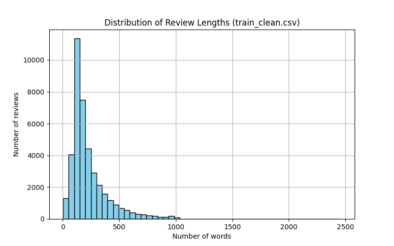

# 12333472_Applied_DL_NLP_Sentiment_Analysis
# Applied Deep Learning Project (WS2025)
**Assignment 2 – Hacking (Sentiment Analysis on IMDB Movie Reviews Datast using RoBERTa model)**  
**Name:** Aman Bhardwaj  
**Student ID:** 12333472  

---

## Introduction

This assignment focuses on implementing a **binary sentiment classifier** for the IMDB Movie Reviews dataset which I selected for the project using deep learning. I am using RoBERTa model which uses a byte-level Byte-Pair Encoding (BPE) as its tokenization method. The RoBERTa model was pretrained on a massive amount of text data, including:

    Books
    News articles
    Web text
    Social media posts (specific variants were trained on datasets like 124 million tweets).
  
The goal of this assignment is to:

- Build an end-to-end pipeline: **preprocessing → tokenization → training → evaluation**.
- Implement a **baseline RoBERTa model**.
- Reimplement and Fine-tune the model to improve performance through **optimized hyperparameters**.
- Compare baseline and optimized models using standard metrics: Accuracy, Precision, Recall, F1-score, Loss, and Runtime. I used F1 as the **Main Metric** of comparison between the models. The target value I wanted to achieve for F1 is >= 0.90
- Generate visualizations for comparison.

**Key highlights:**

- Ran **8 different configurations** for the optimized model over ~15 hours.
- Determined the **best hyperparameters** for training/validation using Randomized Search (Grid Search for this task is too expensive).
- Evaluated optimized and baseline models on **train, validation, and test splits**.
- Saved metrics and plots for visual reporting.

---

## Preprocessing Pipeline

Raw IMDB Dataset (CSV)
       │
       ▼
Train / Validation / Test Split (80/10/10)
       │
       ▼
Minimal Text Cleaning
       │
       ▼
Cleaned CSV Files (split by train/val/test)
       │
       ▼
RoBERTa Tokenization
       │
       ▼
Save Tokenized Tensors (.pt files)


### Steps Implemented:

1. **Loading Dataset**
   - IMDB Large Movie Review Dataset: 50,000 labeled reviews.
   - Columns: `review` (text), `sentiment` (positive/negative).

2. **Train / Validation / Test Split**
   - Split **before preprocessing** to avoid leakage:
     - Train: 80%  
     - Validation: 10%  
     - Test: 10%  
   - Stratified split to maintain class balance.
   - Saved raw splits in `split_raw_data/`.

3. **Text Cleaning**
   - Removed **HTML tags** like `<br />`.
   - Normalized multiple spaces into a single space.
   - **No lowercasing, punctuation removal, stopword removal, or stemming**, as RoBERTa is pretrained on raw text.
   - Saved cleaned CSVs in `preprocessed_clean_data/`.

4. **Tokenization**
   - Used **RoBERTa tokenizer** to convert text into:
     - **Input IDs** (subword tokens)
     - **Attention masks**
   - Padded/truncated sequences to `max_length=256`.
   - Saved `.pt` files for train/val/test in `tokenized_files/`.

5. **Label Encoding**
   - Sentiment labels manually encoded as:
     - `0` → negative
     - `1` → positive
   - And then saved as tensors for training and evaluation.

---

## Preprocessing & Postprocessing Tests

Implemented **unit tests using `pytest`**:

1. **Preprocessing tests**

   - Verify CSV splits exist.
   - Check split sizes match original dataset.
   - Confirm cleaned texts have no `<br>` tags and normalized spaces.
   - Validate tokenized tensors exist and shapes are correct.
   - Check label integrity (only 0/1 and match input size).
   - Histogram of review lengths (train set)
  
    

3. **Postprocessing tests**

   - Tiny forward/backward pass with RoBERTa on CPU.
   - Check logits shape and predictions validity.
   - Metrics calculation (accuracy, precision, recall, F1).
   - Save/load CSV files and plot confusion matrix.
   - Confusion matrix plotting

**Run tests with:**

```
python -m pytest -v -s test_preprocessing.py
python -m pytest -v -s test_postprocessing.py
```
All tests passed, ensuring preprocessing and postprocessing pipelines are correct.

## Model Training

**Baseline Model**

RoBERTa with linear classification head.
Trained head only for 5 epochs.
Saved metrics in baseline_model_results/

Baseline Results Table:
| Split | Accuracy | Precision | Recall | F1-score | Error  | Loss   | Runtime (s) |
| ----- | -------- | --------- | ------ | -------- | ------ | ------ | ----------- |
| Train | 0.8667   | 0.8824    | 0.8462 | 0.8639   | 0.1333 | 0.3757 | 492.02      |
| Val   | 0.8611   | 0.8867    | 0.8280 | 0.8564   | 0.1389 | 0.3786 | 54.66       |
| Test  | 0.8626   | 0.8726    | 0.8492 | 0.8607   | 0.1374 | 0.3762 | 60.74       |

The baseline model of RoBERTa showed good results given it was trained for 5 epochs with minimal training only for head classifier adn with default hyperparameters. I kept batch_size = 32 same as the optimized model for better comparison.

Below are the plots of the baseline model: (Rest of the plots are saved in baseline_model_results folder)


**Optimized Model (Reimplemented/Fine-Tuned)**

Fine-tuned RoBERTa with:

Dropout, weight decay, learning rate, scheduler, pooling tuned etc.
Ran 8 configurations over ~15 hours.

Hyperparameters tested (configurations):

Learning rate: 1e-5, 2e-5, 3e-5

Batch size: 16, 32

Dropout: 0.1, 0.2

Weight decay: 0, 0.01

Scheduler: cosine, linear

Pooling: CLS / mean

Best configuration after training:
{
  "lr": 1e-05,
  "batch_size": 32,
  "dropout": 0.1,
  "weight_decay": 0.0,
  "scheduler": "cosine",
  "warmup_ratio": 0.06,
  "pooling": "cls"
}

## Training & Validation Results (Best Model). 
Tokenized Tensors
       │
       ▼
RoBERTa Classifier Training (8 configs)
       │
       ▼
Validation Monitoring / Early Stopping
       │
       ▼
Best Model Selection
       │
       ▼
Test Set Evaluation
       │
       ▼
Metrics Comparison (Optimized vs Baseline)
       │
       ▼
Plots: Loss Curves, Confusion Matrix, Metric Comparison


Here I only put the results of the best configuration in the table for further comparison. All other 7 configuration results are saved in train_val_results folder.

| Metric      | Train   | Validation |
| ----------- | ------- | ---------- |
| Accuracy    | 0.9862  | 0.9429     |
| Precision   | 0.9850  | 0.9431     |
| Recall      | 0.9875  | 0.9427     |
| F1-score    | 0.9862  | 0.9429     |
| Error       | 0.0138  | 0.0571     |
| Loss        | 0.0209  | 0.2864     |
| Runtime (s) | 5722.76 | 5722.76    |

From the table it can bee seen that the training metrics are quite high. Also, the training time took around 2 hours for each configuration, for some it took less due to early stopping when even after some epochs their performance metrics were not increasing. The validation set showed a bit less performance than the test set which is understandable as the size of th validation set is 8 times smaller than training set.
Below are the plots for the training of the model, validation confusion matrix and runtimes. Rest of th plots are saved in train_val_plots folder:


## Test Results (Best Model):

| Split | Accuracy | Precision | Recall | F1-score | Error  | Loss   | Runtime (s) |
| ----- | -------- | --------- | ------ | -------- | ------ | ------ | ----------- |
| Test  | 0.9430   | 0.9355    | 0.9516 | 0.9435   | 0.0570 | 0.2727 | 197.21      |

So from the above tables it can be seen that the F1 score improved a bit for the test set and Cross Entropy Loss also improved a little. For training I used early stopping patience = 2 which helped to stop tghe epochs whenever the metrics started decreasing.
Below are the plots for the testing of model:


Below is the plot comparing the metrics, runtimes and loss of training, validation  and testing of the optimized (fine-tuned) model:


## Comparison: Optimized vs Baseline 

**Test Set Metrics Comparison Table**

| Metric      | Optimized (Fine-Tuned) | Baseline RoBERTa |
| ----------- | ---------------------- | ---------------- |
| Accuracy    | 0.9435                 | 0.8626           |
| Precision   | 0.9355                 | 0.8726           |
| Recall      | 0.9516                 | 0.8492           |
| F1-score    | 0.9435                 | 0.8607           |
| Error       | 0.0570                 | 0.1374           |
| Loss        | 0.2727                 | 0.3762           |
| Runtime (s) | 197.21                 | 60.74            |

So from the above table it can be clearly seen that my reimplemented and fine Tuned RoBERTa model performed quite better than the SOTA baseline RoBERTa model. The cross entropy loss for optimized model is very less as compared to the base model. The Primary metric for comparison i took was F1 score and it can be seen that the Optimized model has higher F1 score as compared to the baseline model.
So,
-The optimized model significantly outperforms the baseline across all metrics.
-Fine-tuning all layers and hyperparameter tuning led to higher F1-score (0.9435 vs ~0.8607).

The below plots show this behaviour and show how the optimized model perfoems better than the baseline RoBERTa in all aspects: 


Finally, below is the plot which shows the comparison of the **Main Metric (F1)** of comparison between the Optimized and the Baseline RoBERTa model. The F1 score of the Optimized model is significamtly higer and thus shows better performance than the base model as can be noticed from the plot below:


## CI / Auto-formatting

-CI YAML file: .github/workflows/ci.yml
-Runs on push and pull request:
-Installs dependencies from requirements.txt
-Runs pytest -v automatically
-Caches pip packages to speed up workflow
-Uploads test reports as artifacts


